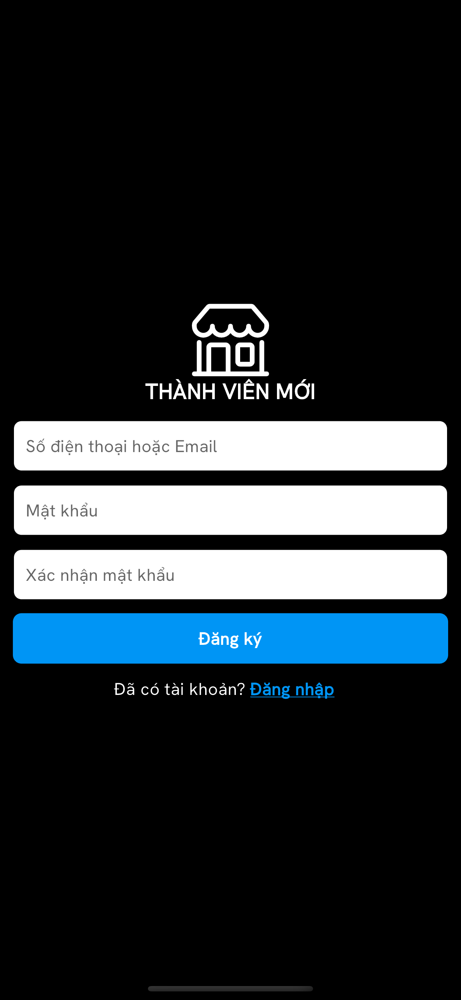

# API Links
- [Swagger API 1](http://phucha.duckdns.org:5001/swagger/index.html)
- [Swagger API 2](http://phucha.duckdns.org:7001/swagger/index.html)
- [Swagger API 3](http://phucha.duckdns.org:8001/swagger/index.html)

## Get Started
1. After cloning the code to your computer, open the terminal inside the project and enter `flutter pub get`. This command will automatically set up the packages used in the project.
2. Select a simulator device.
3. Press F5 to launch the application in debug mode.

## Application Screens
- **Login / Register**

    
    

- **Browse Products / Filter Products / View Product Details**
- **Cart / CRUD Cart / Payment History**
- **User / Change Password / Create & Update Shipping Information**
